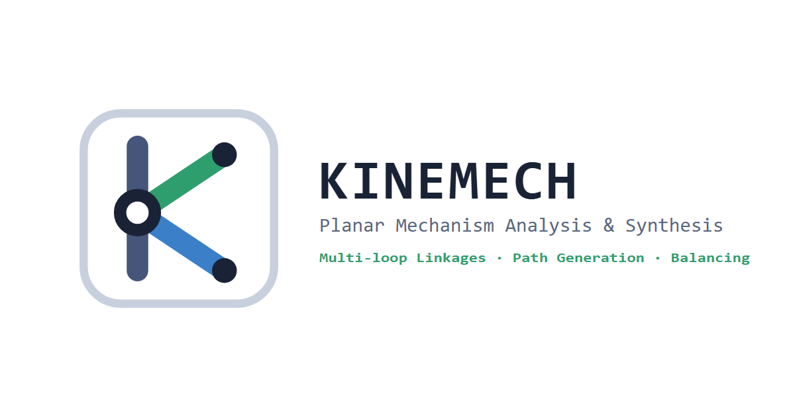
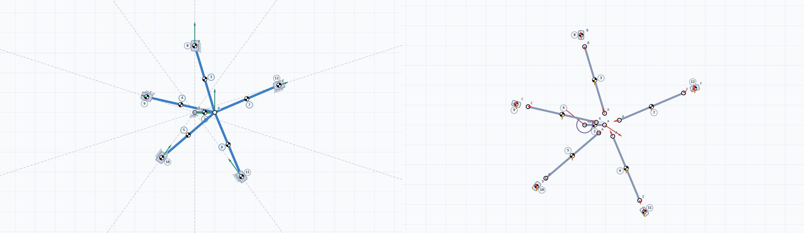

# KineMech

Two in-browser tools for 2D pin/slider mechanisms, sharing one codebase.

The **analyzer** builds a linkage from joints and links, drives it, and gives
exact position, velocity, and acceleration at every instant — including
non-Grashof rockers, multi-loop mechanisms, and ternary links. The
**synthesizer** goes the other way: prescribe coupler positions, a path to
trace, a function to generate, or a quick-return time ratio, and it finds the
four-bar or offset slider-crank that does it — then hands that linkage straight
to the analyzer. 

## What it solves

- General planar pin-jointed and slider mechanisms — not limited to the
  textbook four-bar/slider-crank closed forms. Multi-loop topologies, ternary
  (or higher) links, and rotating-slot (pin-in-slotted-lever) joints all work
  through the same general constraint solver.
- Full position/velocity/acceleration at the current crank angle, via
  Newton–Raphson on the constraint vector Φ(q) and the same Jacobian reused
  for the velocity and acceleration linear solves.
- Gear pairs at fixed centers — external or internal mesh, ratio and pitch
  radii solved automatically from the center distance already placed;
  treated as an ordinary kinematic constraint alongside pins and slots, not
  a bolted-on special case.
- Degrees-of-freedom check before solving — refuses to solve an
  under/over-constrained sketch instead of guessing a configuration.
- Dead-point / non-Grashof detection — reports a toggle position instead of
  silently failing or jumping branches.
- Grashof classification and transmission-angle quality (min/max over a full
  crank revolution), for a plain pin-jointed four-bar.
- Optional kinetostatic dynamics — per-link mass/inertia/CG, gravity,
  applied point loads/torques, and linear or torsional springs/dampers all
  feed one frictionless Newton–Euler linear system per pose, giving every
  joint reaction and the crank torque needed to sustain the current ω₂/α₂ —
  plus an exploded free-body-diagram view (element forces shown alongside
  the reactions) and full-cycle peak reactions/torque. This is
  kinetostatics, not forward dynamics: a spring/damper changes what it
  *costs* to move the mechanism through motion you've already prescribed,
  not how fast it moves on its own — for sizing a spring against gravity,
  checking a gas strut holds a position, or finding peak damper force over
  a stroke.

## Synthesis

Offered up front: while the workspace is empty, the stage shows a launch panel
with **Analyze** and **Synthesize** side by side, so the second half of the
tool isn't something you have to go looking for. It's also reachable from the
analyzer's **Joints** step (next to image tracing — both answer the same
question, where the geometry comes from) and from the `⋯` menu on any step,
which is the one that matters after a handoff, since that lands on Drive.

- **Motion generation** — prescribe two, three or four coupler postures; the ground
  pivots fall out of the perpendicular-bisector / circle construction. Norton's
  alternate moving pivots (W, Z anywhere on the coupler body) are supported, so
  the same prescribed motion can be re-pivoted for a better Grashof condition
  or transmission angle.
- **Path generation** — two ways to say where the coupler point has to go.
  *Precision points*: prescribe three or four points it must pass through.
  Giving each point a coupler orientation turns it into a posture, so the same
  construction applies (four points pin the moving pivots to the Burmester
  curve). Those orientations and the pivots are free choices, and nearly all of
  them produce a linkage that hits every point and still can't be built — so
  **Solve free choices** searches them for one that is Grashof, keeps a workable
  transmission angle, and clears the circuit, branch, and order defects,
  optionally matching a prescribed crank angle at each point.
  *Target curve*: import a whole path — a `.kinepath` document, an `x,y` CSV, or
  a path sent straight over from the analyzer's traced joint — and **Match**
  fits a four-bar to it, searching link lengths, coupler point and placement
  together. Nothing is exact here, so the fit reports how far the coupler curve
  strays from the target, as RMS and worst case, and marks the worst miss on the
  canvas. Both searches are deterministic: the same inputs always give the same
  linkage.
- **Function generation** — Freudenstein's three-point solution with optional
  Chebyshev spacing, reporting structural error across the domain.
- **Quick-return slider** — stroke plus time ratio, via the inscribed-angle
  construction, with the achieved stroke and ratio checked against the targets.

Each mode reports Grashof class and transmission-angle extremes, animates the
result, and can export a GIF. Every mode but the slider-crank can also
overlay its two Roberts–Chebyshev cognates — the other four-bars that trace
the identical coupler curve — in case one clears a Grashof or transmission-
angle limit the original doesn't. **Analyze this linkage** sends it over — landing
on **Drive**, since joints, links, and roles all arrive defined and ω₂ (or
v₂/a₂) is the first real decision left. The design inputs stay in the
synthesizer, so going back to nudge a posture and re-send is one click.

## Workflow

1. **Joints** — place pin, slider, or gear joints.
2. **Links** — pick a connection type. Rigid (default): click 2-4 joints in
   sequence into one rigid body (binary, ternary, …). Linear: click 2 joints
   to connect them with a spring/damper. Torsional: pick two links (or a
   link and ground) from the panel — no clicking.
3. **Roles** — pick the ground link and the driving (crank) link.
4. **Geometry** — optionally trace over a background image: calibrate scale
   from two points + a known real distance, then pin exact driving
   dimensions (length/angle) that refine the sketch without moving the
   traced overlay. For a gear, set its exact pitch radius, pick its mesh
   partner, and choose external or internal mesh — the ratio and both radii
   solve from the centers already placed.
5. **Elements** — optionally set mass, inertia, and CG for each link/slider
   (this is the gate: every moving link needs it before force analysis
   unlocks anywhere), and the stiffness/rest length/damping for any
   springs/dampers added on the Links step.
6. **Drive** — set crank angle, angular velocity ω₂, angular acceleration α₂
   (or v₂/a₂ for a slider driver) — and, once mass is set, applied point
   loads/torques and gravity.
7. **Solve** — animate, inspect per-joint velocity/acceleration vectors and
   (once mass is set) joint reactions/input torque, view
   velocity/acceleration polygons and the exploded free-body diagram —
   including any spring/damper's own carried force — alongside the
   mechanism, check Grashof/transmission-angle quality, and chart any
   joint/link/shaking-force/element quantity over a full cycle against
   crank angle or time.

Ten built-in presets (four-bar, change-point four-bar, slider-crank in
crank-driven, slider-driven, and spring-returned form, Whitworth quick-return,
crank-shaper with mass, four-bar with mass+gravity, geared four-bar,
five-cylinder radial engine) load in one click and double as the solver's
regression fixtures — each exercises a distinct part of the solver.

## I/O

- **`.kinemech`** — self-contained JSON save (joints, links, roles, drive
  state, dimensions, calibration, embedded background image). Round-trips
  through Save/Load here, and is what the synthesizer exports — so a
  synthesized four-bar opens directly here for full velocity/acceleration
  analysis, in the standalone builds as well as through the in-app handoff.
- **`.kinepath`** — a curve: points, an optional crank angle per point, and
  whether it closes. The analyzer writes one from a traced joint (Solve step,
  **Send to path matching**) and the synthesizer's target-curve mode reads it;
  plain `x,y[,theta]` CSV is accepted too, so a path measured elsewhere can be
  brought in without conversion.
- **Autosave** — mirrors the mechanism into localStorage as you build; an
  unexpected crash or refresh offers the last autosaved snapshot back as a
  download instead of losing it.
- **CSV export** — any full-cycle plot (position/velocity/acceleration/
  reactions/torque/shaking force) exports to CSV.
- **GIF export** — captures one drive cycle (mechanism + polygon panel if
  open) as an animated GIF.
  

