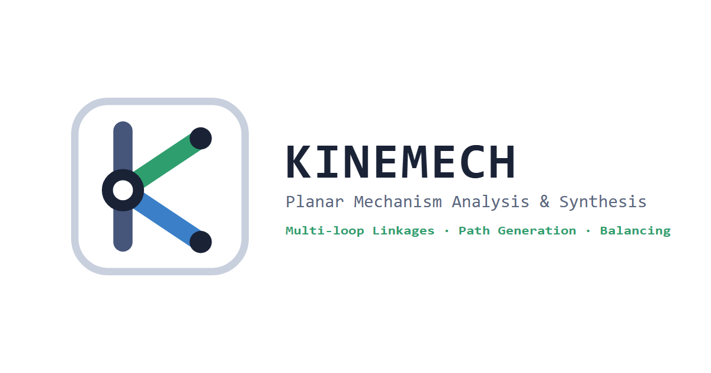
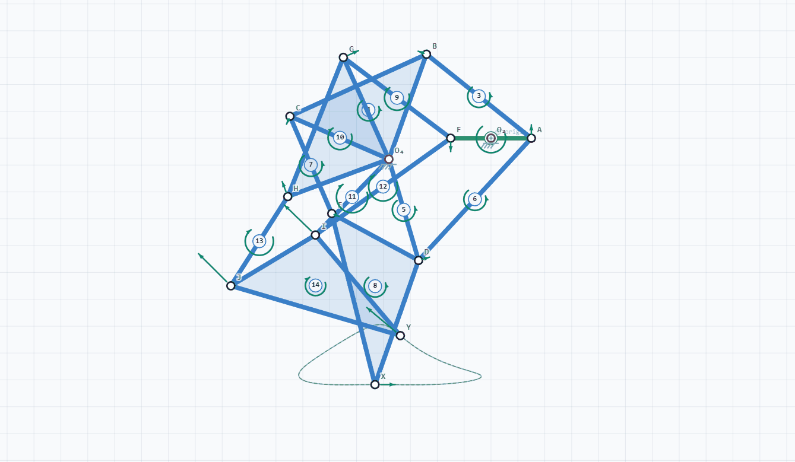

# KineMech

KineMech is a browser-based tool for analysis and synthesis of planar pin and slider mechanisms.

It includes three integrated tools:

- **Analyzer:** builds a mechanism from joints and links and performs position, velocity, acceleration, and optional kinetostatic analysis.
- **Synthesizer:** designs four-bar, offset slider-crank, and six-bar mechanisms from prescribed motion, path, function, quick-return, or dwell requirements.
- **Profiler:** generates plate, cylindrical, or linear cam profiles from a motion program and checks them for pressure angle and undercut.

All three tools use the same mechanism representation. A synthesized mechanism can be transferred directly to the analyzer, and a cam profile designed in the Profiler can be paired with a follower joint there for full kinetostatic analysis of the contact.

## What's new in version 3

- Motion generation with specified fixed pivots, prescribed link rotations, rocker output, and a driver dyad for non-Grashof results.
- Path generation that hits a prescribed crank angle at each point exactly, and target curves drawn and edited on the canvas.
- Function generation with four or five precision points.
- Quick return with a four-bar crank-rocker, a drag-link six-bar, and a Whitworth six-bar, alongside the slider-crank.
- Double-dwell six-bar synthesis.
- Circuit, branch, and order defects reported for every precision position.
- A canvas switch that prints coordinates and angles next to their labels.
- Canvas and panels linked both ways: hovering a result or settings card highlights its link or joint, and clicking a link or joint highlights its cards.
- Clearer handoffs between the tools: each button names its destination, and the receiving tool shows where the design came from with a named way back.
- Slotted links drawn as a slotted bar with its sliding block, in both the analyzer and the synthesizer.
- A Jansen walking linkage preset: two legs driven by one crank, opening with a foot's path traced.
- Crank balancing that keeps the page responsive, shows its progress, and can be stopped early.
- Status messages shown over the canvas on every step of the analyzer.
- Touch and click fixes: a canceled touch no longer places or selects anything, Reset also clears a half-placed cam or pairing, and linked cards show a pointer cursor.
- If the browser blocks local storage, the tools keep working and say that autosave is off, instead of locking the tab.

## Analysis

The analyzer supports general planar mechanisms rather than being limited to standard four-bar and slider-crank equations.

### Kinematic analysis

- Pin, slider, fixed-center gear pairs, rotating-slot joints, and cam-follower pairs.
- Multi-loop mechanisms and binary, ternary, and higher-order links.
- Position analysis using a general constraint formulation.
- Velocity and acceleration analysis using the same constraint Jacobian.
- Newton-Raphson solution of the constraint equations.
- Automatic degrees-of-freedom checking before solving.
- Dead-point and non-Grashof detection.
- Grashof classification for four-bar mechanisms.
- Minimum and maximum transmission angle over a complete crank revolution.
- Visualization of velocity and acceleration vectors and polygons.
- Slotted links drawn as a bar with the slot cut where the pin travels and the sliding block riding in it.
- Full-cycle plots of position, velocity, and acceleration.

### Kinetostatic analysis

The analyzer can also perform frictionless kinetostatic analysis when mass and inertia properties are specified.

For each moving link, the user can define:

- Mass
- Mass moment of inertia
- Center of gravity

The analysis can include:

- Gravity
- Applied point forces
- Applied torques
- Linear springs and dampers
- Torsional springs and dampers

The solver determines joint reactions and the input torque required to maintain the prescribed angular velocity and acceleration. Results can be viewed using an exploded free-body diagram and full-cycle plots of reactions, torque, and shaking force.

A counterweight can be added to the driving crank to reduce this shaking force. The exact rotating-mass solution is computed directly, then a numerical search refines its placement to minimize the whole mechanism's shaking force rather than just the crank's own, and a before/after comparison is reported. The search shows its progress while it runs and can be stopped early, keeping the best placement found so far.

This is **kinetostatic analysis**, not forward dynamics. The motion is prescribed, and the analysis determines the forces and torque required to produce that motion.

## Synthesis

The synthesizer provides several mechanism synthesis methods and can transfer the resulting mechanism directly to the analyzer.

### Motion generation

Prescribe two, three, or four coupler positions. Each position can be given as point A and an angle, or as points A and B.

The synthesis uses geometric constructions based on perpendicular bisectors and circle intersections. Alternate moving pivots can also be selected, allowing different four-bar configurations to be evaluated for Grashof condition and transmission angle.

The pivots can be chosen in several ways:

- **Two positions:** each ground pivot can sit anywhere on its perpendicular bisector. It can be dragged along the bisector, or placed by how far its link turns between the two positions. The canvas marks that swing at each pivot.
- **Rocker output:** with two positions, the coupler body itself becomes the output rocker, pivoted at its rotation pole and driven by a crank-rocker whose crank pivot lies on the chord through the two rocker positions. A rocker that swings through a given angle between two positions, the classic pure-rotation case, is entered by placing point A at the rocker's pivot in both positions and point B at the rocker's two ends.
- **Specified fixed pivots:** with three positions, the ground pivots are chosen and the moving pivots are found by inversion.
- **Prescribed rotations:** with three positions, the crank rotations β₂, β₃ and rocker rotations γ₂, γ₃ from position 1 are entered directly, and the moving pivots follow from the dyad equations. The canvas shows each angle where it is measured.

When the resulting four-bar's input cannot turn fully, a **driver dyad** can be added: a crank-rocker that rocks the input link between its extreme positions, giving a six-bar driven by a full-turn crank.

Circuit, branch, and order defects are classified for every precision position, from the closed-form range of the input angle rather than from a sampled sweep.

### Path generation

Two approaches are available.

**Precision points**

Specify three or four points that the coupler point must pass through. Coupler orientations can also be prescribed. For four prescribed positions, the corresponding moving pivots can be determined from the Burmester curve.

The **Solve free choices** option searches the available geometric choices for a mechanism that satisfies the specified points while considering:

- Grashof condition
- Transmission angle
- Circuit, branch, and order defects
- Optional crank-angle requirements

Prescribed crank angles are met exactly, not approximately: the coupler point reaches each precision point at its own crank angle. The crank's direction of rotation and, for four points, the assembly branch can be chosen.

**Target curve**

A complete path can be imported as:

- `.kinepath`
- `x,y` CSV
- A traced path sent directly from the analyzer

It can also be drawn on the canvas: clicked points are joined by a smooth spline, open or closed. The points stay on the canvas after the curve is finished, so the spline can be reshaped by dragging a point or typing its coordinates.

The synthesizer searches for a four-bar mechanism by varying link lengths, coupler-point location, and placement. Since the target curve is generally not reproduced exactly, the result reports the RMS and maximum path error and identifies the location of the maximum error.

The search is deterministic, so identical inputs produce the same result.

### Function generation

Function generation is implemented using Freudenstein's equation with three, four, or five precision points, with optional Chebyshev spacing. With four points the rocker's starting angle is also solved for, and with five points both starting angles are. When several linkages pass through the points, they are ranked and each can be inspected. The resulting structural error is reported over the specified domain.

### Quick-return synthesis

Four quick-return mechanisms share one time ratio Q:

- **Offset slider-crank**, from a required stroke, using the inscribed-angle construction.
- **Four-bar crank-rocker**, from a rocker length and swing angle.
- **Drag-link six-bar**, a double-crank four-bar driving a slider.
- **Whitworth six-bar**, a crank driving a slotted lever, which drives a slider.

The achieved time ratio, stroke, and swing are measured by turning the crank a full revolution and are reported next to the requested values.

### Dwell synthesis

Searches for a Stephenson III six-bar mechanism whose output link holds nearly stationary over part of the input revolution, then swings through the rest of it. This is an approximate mechanical alternative to a cam. The search reports the achieved hold window and output swing, and the resulting mechanism can be sent to the analyzer like any other synthesized linkage.

A double dwell holds the output still twice per revolution. The coupler curve needs two near-circular arcs of the same radius, and the output pivot sits where the output link can reach the center of either arc. The swing between the two holds is prescribed, and both hold windows and the achieved swing are reported.

### Additional synthesis features

Each synthesis mode:

- Reports the Grashof classification.
- Reports minimum and maximum transmission angles.
- Animates the resulting mechanism.
- Can export the mechanism as a GIF.

Four-bar synthesis modes can also display the two Roberts-Chebyshev cognates, which generate the same coupler curve.

In motion and path generation, the canvas can show the construction geometry behind a result, and a values switch prints coordinates next to point labels and the size of each marked angle.

A synthesized mechanism can be sent directly to the analyzer for further kinematic and kinetostatic analysis. This includes the six-bars, slotted links, and rocker outputs, not only the four-bars.

## Cam design

The Profiler generates a cam profile from a motion program: a sequence of rise, dwell, and fall segments, each assigned a motion law from uniform, parabolic, simple harmonic, cycloidal, modified trapezoid, modified sine, or 3-4-5 and 4-5-6-7 polynomial. The program is checked against the fundamental law of cam design before a profile is generated.

Three cam families are supported:

- Plate (radial disk) cams.
- Cylindrical (grooved drum) cams.
- Linear (translating) cams.

For plate cams, the follower can be a knife edge, roller, flat face, or spherical face, mounted in-line, offset, or pivoted. The generated profile is checked for pressure angle against the usual translating/pivoted limits and for undercut (or, for a flat face, for the concavity it cannot follow).

A cam designed in the Profiler can be paired with a follower joint in the analyzer, where the contact is treated as a frictionless higher pair: the solver reports the contact force along the common normal, detects follower jump, and includes any return spring holding the pair closed. The Profiler can also animate the cam turning under its follower and export the result as a GIF.

## Workflow

The analyzer follows a step-by-step mechanism construction workflow.

1. **Topology**  
   Place pin, slider, gear, or cam joints. Connect them with rigid links (a link can span two or more joints, allowing binary, ternary, and higher-order links) or with linear/torsional spring-damper elements. Choose which joints are held fixed as the ground.

2. **Geometry**  
   Optionally trace a mechanism from a background image. Scale can be calibrated using two points and a known distance. Exact dimensions can then be specified for driving joints without moving the traced image.

   For gear joints, the pitch radius, mesh partner, and external or internal mesh are specified. For cam joints, the base-circle radius sets a starting size, and the full profile is designed in the Profiler, which can be opened directly from the mechanism.

3. **Elements**  
   Specify mass, inertia, and center of gravity for moving links and sliders. Spring and damper properties can also be defined.

4. **Drive**  
   Choose the driving link, then specify crank angle, angular velocity, and angular acceleration. For a slider driver, linear velocity and acceleration can be specified instead. Applied forces, torques, and gravity can be included when mass properties are available.

5. **Solve**  
   Animate the mechanism and inspect position, velocity, acceleration, joint reactions, and input torque. Velocity and acceleration polygons, free-body diagrams, full-cycle plots, and crank balancing are also available.

## Presets

The application includes thirteen built-in mechanisms:

- Four-bar with coupler point, mass, and gravity
- Change-point four-bar
- Hoeken straight-line four-bar
- Jansen walking linkage (two legs on one crank)
- Spring-returned slider-crank
- Slider-driven slider-crank
- Whitworth quick-return
- Shaper (slotted-lever quick-return)
- Five-cylinder radial engine
- Geared four-bar
- Stephenson III six-bar dwell
- Plate cam driving a bell-crank and slider
- Plate cam with a flat-faced follower

These presets also serve as regression cases for different parts of the solver.

The Jansen walking linkage is two Strandbeest-style legs driven half a turn apart. It opens with one foot traced and its full path drawn: a nearly level stance stroke and a lifted return.

## File formats and export

### `.kinemech`

A self-contained JSON mechanism file containing:

- Joints
- Links
- Ground and driving roles
- Drive state
- Dimensions
- Calibration data
- Embedded background image

The file can be saved and loaded directly in KineMech. Synthesized mechanisms use the same format and can therefore be opened in the analyzer.

### `.kinepath`

A path file containing:

- Path coordinates
- Optional crank angle at each point
- Path closure information

The analyzer can generate a `.kinepath` file from a traced joint, and the synthesizer can use it for target-curve synthesis.

Standard `x,y[,theta]` CSV files are also supported.

### `.kinemotion`

A follower motion program: displacement and its derivatives against cam angle, with whether it closes over one revolution and whether the output is a translation or a rotation.

The Profiler exports the program behind a designed cam, and the analyzer can export a solved joint or link's own motion as one. Either can be opened in the Profiler, which fits an imported program with a Fourier series before generating a profile from it. Standard CSV is also supported.

### Autosave

The current mechanism is automatically stored in the browser's local storage. After an unexpected refresh or crash, the last autosaved mechanism can be recovered and downloaded.

If the browser blocks local storage, as some private windows do, the tool keeps working and shows that autosave is unavailable, so the work should be saved to a file before closing.

### CSV export

Full-cycle plots can be exported as CSV, including:

- Position
- Velocity
- Acceleration
- Joint reactions
- Input torque
- Shaking force
- Element forces

### GIF export

A complete drive cycle can be exported as an animated GIF, including the mechanism and the velocity/acceleration polygon panel when it is open.
